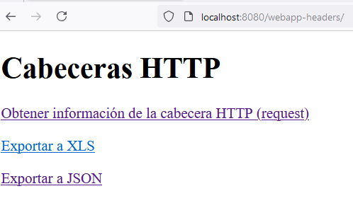
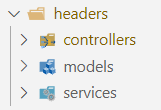
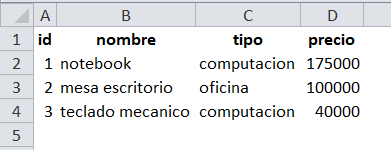
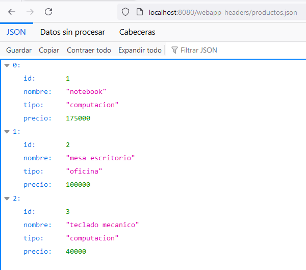

# Ejercicio 1: cabeceras HTTP del request. Creación de un informe HTML

Vas a implementar una aplicación web que genere un informe html con todos los datos de la cabecera HTTP del request.

Para ello, ee proporciona el método doGet de un servlet.

```
    @Override
    protected void doGet(HttpServletRequest req, HttpServletResponse resp) throws ServletException, IOException {

        resp.setContentType("text/html;charset=UTF-8");

        // Obtiene el método HTTP utilizado en la solicitud (GET, POST, etc.).
        String metodoHttp = req.getMethod();
            
        // Obtiene la URI de la solicitud.
        String requestUri = req.getRequestURI();

        // Obtiene la URL completa de la solicitud.
        String requestUrl = req.getRequestURL().toString();

        // Obtiene el contexto de la aplicación donde se ejecuta el servlet.
        String contexPath = req.getContextPath();

        // Obtiene la ruta del servlet.
        String servletPath = req.getServletPath();

        // Obtiene la dirección IP del cliente que realiza la solicitud.
        String ipCliente = req.getRemoteAddr();

        // Obtiene la dirección IP local donde se ejecuta el servlet.
        String ip = req.getLocalAddr();

        // Obtiene el puerto local en el que está escuchando el servidor.
        int port = req.getLocalPort();

        // Obtiene el esquema de la solicitud (http o https).
        String scheme = req.getScheme();

        // Obtiene el valor de la cabecera "host" de la solicitud.
        String host = req.getHeader("host");

        // Construye la URL completa utilizando el esquema, el host, el contexto y la ruta del servlet.
        String url = scheme + "://" + host + contexPath + servletPath;

        // Construye una URL alternativa utilizando la IP local, el puerto, el contexto y la ruta del servlet.
        String url2 = scheme + "://" + ip + ":" + port + contexPath + servletPath;

        try (PrintWriter out = resp.getWriter()) {

            out.println("<!DOCTYPE html>");
            out.println("<html>");
            out.println("    <head>");
            out.println("        <meta charset=\"UTF-8\">");
            out.println("        <title>Cabeceras HTTP Request</title>");
            out.println("    </head>");
            out.println("    <body>");
            out.println("        <h1>Cabeceras HTTP Request!</h1>");
            out.println("<ul>");
            out.println("<li>metodo http: " + metodoHttp + "</li>");
            out.println("<li>request uri: " + requestUri + "</li>");
            out.println("<li>request url: " + requestUrl + "</li>");
            out.println("<li>context path: " + contexPath + "</li>");
            out.println("<li>servlet path: " + servletPath + "</li>");
            out.println("<li>ip local: " + ip + "</li>");
            out.println("<li>ip cliente: " + ipCliente + "</li>");
            out.println("<li>puerto local: " + port + "</li>");
            out.println("<li>scheme: " + scheme + "</li>");
            out.println("<li>host: " + host + "</li>");
            out.println("<li>url: " + url + "</li>");
            out.println("<li>url2: " + url2 + "</li>");

            
            Enumeration<String> headerNames = req.getHeaderNames();
            while (headerNames.hasMoreElements()) {
                String cabecera = headerNames.nextElement();
                out.println("<li>"+ cabecera + ": " + req.getHeader(cabecera) + "</li>");
            }
            out.println("</ul>");
            out.println("    </body>");
            out.println("</html>");
        }
    }
```

### Pasos
1. Crea un proyecto llamado **webapp-ut03** con el que vamos a trabajar en esta unidad de trabajo.
2. Crea un servlet al que vas a añadir el código del método GET. El url pattern del dicho servlet será **cabeceras-request**
3. Ejecuta el servlet y observa lo que recibes por pantalla.
4. Mejora tu aplicación web incluyendo JSP.
5. Después aprenderás a usar JSTL para mejorar tu página JSP. 

# Ejercicio 2: cabeceras HTTP del response

Continuamos con el mismo proyecto.

Vamos a listar productos en diferentes formatos.

Añade esta página index.html:

```
<!DOCTYPE html>
<html lang="en">
<head>
    <meta charset="UTF-8">
    <meta name="viewport" content="width=device-width, initial-scale=1.0">
    <title>UT03</title>
</head>
<body>
    <h1>TRABAJANDO CON CABECERAS HTTP</h1>
    <p><a href="cabeceras-request">Obtener información de la cabecera HTTP (request)</a></p>
    <p><a href="productos.xls">Exportar a XLS</a></p>
    <p><a href="productos.json">Exportar a JSON</a></p>
</body>
</html>
```




Ahora nuestro proyecto tendrá una estructura de fuentes Java similar a la siguiente:




### Generar informe de productos XLS

Vamos a exportar los productos a un archivo XSL sencillo, una tabla con datos.

Tenemos que crear un nuevo servlet, controlador, llamado **ProductoJsonServlet** donde usaremos el método doPost para tal fin. Sigue las instrucciones de tu profesor. Deberás añadir el siguiente código:

```
        ServletInputStream jsonStream = req.getInputStream();
        ObjectMapper mapper = new ObjectMapper();

        // En vez de una lista, trabajamos con un solo producto
        Producto producto = mapper.readValue(jsonStream, Producto.class);
```

Si queremos trabajar con xsl de una forma más compleja debemos utilizar una API específica, por ejemplo, con Apache POI es una API Java para importar y exportar datos para documentos Microsoft(Excel, Word, Project, etc.)...

1. Creamos clase Producto.
2. Creamos los servicios ProductoService (interface) y ProductoServiceImpl con datos fijos, no cogidos de una base de datos.
3. Creamos el controlador, ProductoXlsServlet.
4. En el navegador ponemos la ruta al servlet con la extensión xsl y por código detecta que va a generar un xsl en vez de un html:
@WebServlet({"/productos.xls", "/productos.html", "/productos"})

OJO!!! No es una extensión real. Es simplemente el nombre que le hemos dados, no hace falta que tenga el .xls, podría haberlo llamado productosXSL….



### Generar informe de productos JSON

1. Vamos a usar la librería Jackson. Podríamos usar también la librería GSON.
2. Necesitamos añadir en el pom.xml la dependencia de Jackson.
```
      <!-- https://mvnrepository.com/artifact/com.fasterxml.jackson.core/jackson-databind -->
        <dependency>
            <groupId>com.fasterxml.jackson.core</groupId>
            <artifactId>jackson-databind</artifactId>
            <version>2.17.2</version>
        </dependency>
```
3. Creamos en controllers, el Servlet ProductoJsonServlet.

Ahora nuestro Servlet puede hacer funcionar como un API Rest y devolver un JSON en vez de un HTML.



### Enviar un JSON a un Servlet

Enviar datos a nuestro backend. 

Para probarlo necesitamos un cliente HTTP, no puedo ser un navegador, debe ser un cliente que pueda enviar y recibir datos a un servicio web.

Usaremos **PostMan** que sirve para probar datos de servicios web API Rest.


Vamos a la página https://www.postman.com/ lo descargamos e instalamos o lo usamos directamente vía web.


